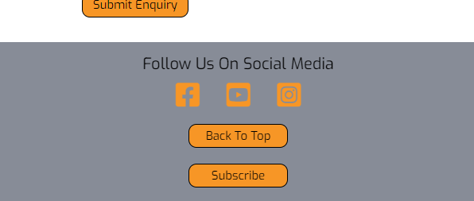

# The Llewellin Duo - First Milestone Project


## **Goal for this project** 

The Llewelin Duo 

The band can perform at a variety of venues, ranging from small cosy pubs to large scales weddings where they will provide the perfect atmosphere to get everyone on their feet dancing the night away.
This webistes purpose is to promote an acoustic guitar duet, who specialise in a unique Spanish-flaminco style,instrumental duet. 

To supply information regarding the band, upcoming events and giving the user images and example audio/video to help them make thier decision in contacting the band to book. A relavant, resposive and user friendly design is the aim here.

An intuitive and exciting user experience is key with information to be found easily is important.

Thank you for visiting my project!

Any questions, please feel free to contact me via my github page. Thanks!

---
<a></a>
## Table of contents 
* [UX](#ux)
    * [User Goals](#user-goals)
    * [User Stories](#user-stories)
    * [Site Owners Goals](#site-owners-goals)
    * [User Requirements and Expectations](#user-requirements-and-expectations)
        * [Requirements](#requirements)
        * [Expectations](#expectations)
    * [Design Choices](#design-choices)
        * [Fonts](#fonts)
        * [Icons](#icons)
        * [Colors](#colors)
        * [Structure](#structure)
* [Wireframes](#wireframes)
* [Features](#features)
    * [Existing Features](#existing-features)
    * [Features to be implemented](#features-to-be-implemented)
* [Technologies used](#technologies-used)
    * [Languages](#languages)
    * [Libraries And Frameworks](#libraries-and-frameworks)
    * [Tools](#tools)
* [Testing](#testing)
* [Deployment](#deployment)
* [Bugs](#bugs)
* [Credits](#credits)
* [Acknowledgments](#acknowledgments)


<a name="ux"></a>
## **UX**
<a></a>
### **User Goals**

* A website with content to wow the user into hiring the band for an event
* Website should be easy to navigate on all devices formats such as desktop, tablet & mobile
* Pleasing and clear visual elements
* Understand the bands style and versitility
* Website with call-to-actions
* Provide users with upcoming evnt and venue information 
* Contact form should be easy to find and simple to complete with instruction of the best information to contact the band with
* Subscription button should be easy to find and simple to complete with a maximum of two fields
* Links to social media accounts provided for further content

[Back to Top](#table-of-contents)

<a></a>
### **User Stories**

* As a user, I want to be able to easily find the contact us button to enquire for booking.
* As a user, I want to find music samples relating to the band.
* As a user, I want to see various images of the different venue types they have played at.
* As a user, I want to be able to easily see their upcoming events.
* As a user, I want to know whether the band would be flexible in learning new material for a specific event.
* As a user, I want to be able to subscribe to the latest updates, events and new material.
* As a user, it is important to me that the website is easy and simple to use. 
* As a user, I want the websit to work well on mobile devices. 
* As a user, I want the website to be intuitive to help aid enquiries for bookings.
* As a user, I want to find the contact details quickly and easily.
* As a user, I want contacting the band simple and quick.
* As a user, I want to feel drawn to their style.
* As a user, I want the website to be easy to navigate. 
* As a user, I would like to know a bit about the band themselves.
* As a user, I want there to be links to their social media pages to view aditional content.

<a></a>
### **Site owners Goals**
* Promote the band 
* Increase enquiries
* Increase bookings
* Promote a fun and lively vibe

[Back to Top](#table-of-contents)

<a></a>
### **User Requirements and Expectations**
<a></a>
#### Requirements
* Easy to navigate by using the navigation menu
* Easy to understand live event page
* Simple contact Us form
* Quick and simple way to subscribe to event updates
* Clear information about event types that the band can be hired for.

<a></a>
#### Expectations
* When clicking on external links, I expect the page to open in a new tab
* When clicking to subscribe, i expect the simple completion form to open into a modal popup box within the same page
* I expect a 'Success' notification when submitting the contact/subscription forms to confirm that thier request has been completed
* For all nav links to work correctly
* links on navbar to scroll to their locations rather than jumping
* Website is in line with the customer's journey

[Back to Top](#table-of-contents)

---

<a></a>
### **Design Choices**
I looked through the website [coolors](https://coolors.co/) and found some base colours using the generator, then adjusting the shades i found what worked best whilst providing a good level of contrast for accessibility.

<a></a>
#### **Fonts**
I have used Google fonts to find the desired font styles from this project and have decided font-family: 'Passions Conflict' works best for the bands home page name title as it fits with a previous font style used that band has been using for years that their followers would recognise, but i feel this has an additional level of elegance.
For headings and content i have taken a more simplified clean cut approach to the font styles as being able to read the content clearly and easily is far more important for user experience than flmaboiance.
I have done a bit of reasearch into the most popular fonts and why on google and have come to the conclusion that font-family: 'Lato' would work great for the content as it's very clean but has slight smooth cut charactaristics that i found interesting and drew me in.
I paired font-family: 'Lora' with Lato for my headings, i read this was a popular choice and i'm happy with the results as it clearly stands apart from the content font type producing a punchy cleary heading that in a distant way alos ties into the font type used for the bands name on the main home page.


<a></a>
#### **Icons**
I have decided to implement icons, using the [Font Awesome library](https://fontawesome.com/ "Font Awesome"). I have used a minimalalistic aproach to icons on my website, I've used them for the purpose of social media links and nothing else as i beleive this is their main purpose in this design.

<a></a>
#### **Colors**
The colours i have used for the website are as follows;


* #a58869 = Beaver is my main background colour as i feel it represents a natural wooden colour whilst not drawing attention away from the foreground which i want the user to concentrate on.
* #878C97 = Roman Silver has been chosen for my header and footer as it's subtle and follows suit with the theme of using greys throughout the website and the band also like black and white photography over colour, so i felt this taylors to their general preferences.
* #F79626 = Deep Saffron was chosen for buttons & social media links for two key reasons, firstly the band have enjoyed using orange on their promotional flyers in the past so this falls in line both what they like but also what their followers expect/feel they should be seeing and secondly it also provides a beautiful striking contrast to stand out, getting users to subscribe, contact the band and view further content via their social media outlets.
* #25262C = Raisin Black has worked perfectly as a background colour to promote contrast for sections with content and tables.
* #82CBFF = Light Sky Blue is my "hover" colour as it works across the styling of the whole site.


<a></a>
#### **Structure**
I have decided to use [Bootstrap](https://getbootstrap.com/) to build the base code for my website as it has proven to be an invaluable framework. 
Bootstrap provides various elements of CSS and Javascript which is very helpful to keep a good, responsive structure on my site. 
As Bootstrap is designed for mobile first, I will be certain that my website functions well on mobile.

[Back to Top](#table-of-contents)

--- 
<a></a>
## **Wireframes**
Upon a discussion with my mentor [Balsamic](https://balsamiq.com/wireframes/) is what i have decided to use for designing the wireframes for my project.
I started with a mobile first aproach, so designed the website for mobile devices first, moving to tablets next and finally creating the desktop design.
I have a single page design which i believe will be the best approach as content is generally viewed via a mobile or tablet device in this era. This will ensure that the website is easy to read and navigate.


You can find my wireframes below:

### [Desktop Wireframe](/wireframes/desktop.png)

### [Tablet Wireframe](/wireframes/tablet.png)

### [Mobile Wireframe](/wireframes/mobile.png)


[Back to Top](#table-of-contents)

---

<a></a>
## **Features**


### Navigation

I have used Bootstrap to create my navbar due to it's responsive nature between devices sizes.
For mobile devices i have used a dropdown menu which is a lot cleaner than trying to squeeze all options onto a small navbar.


### Home - Hero Image

I have decided to implement a hero image which spreads over 100% width of the screen. I have set the height at 80vh to show a little of what comes next to entise the user into scrolling down the page.
The image responds well when viewing on desktop, tablet and mobile.


### About Us Section

Here I used the grid from Bootstrap to create 3 colums on desktop & tablet view which turn into full width stacked columns on mobile devices. To help separate the columns i will provide a dark translucent boxes to each field. 


### Live Events Section

For the live events section i will use a responsive background image of the band playing live that will fill the screen on all devices sizes. 

I will implement a table to nest all upcoming event dates, locations and times whilst each location will also be a link to the venues websites for eas of users to be able to contact said venue to enquire to booking tickets to see the band play. This table will be responsive to all device sizes and have a slight translucent backdrop as the background will also help to represent what an event setting could look like.


### Gallery Section

For the gallery images i have decided to use a bootstrap carosel slide show as i felt a gallery with lots of images across the section would take away from the website clean and easy to view look. 

I decided against filling the screen width for the carosel as i wanted it to taper into the bands main content for the section, their live studio recording which is in the form of a youtube embeded video spaning a 100% width of the page on all device sizes as it's the main focal point of the section and something the band want to be prominant on the website to help encourage users to book them.


### Contact Us Section

In the contact-us section i have made the following filed manditory to complete Name, Email, Enquiry Description, I have chosen to leave the phone number as non-complusory as some users do not like to provide phone numbers upon making enquiries, as a whole so doing this should help to build the level of enquiries the band recieve.

In the event and enquiry details section I have used some decriptive place holder text to help guide the user into what they would need to let tyhe band know what they want for booking, this will help the band with returning a comprehensive reply.


### Footer Section

The footer will be kept clean and simple as it will contain the social media links/icons. When on a tablet and desktop i want the social media icons, return to top and subscribe buttons inline, while on a mobile devices i will have the icons and buttons stacked.



[Back to Top](#table-of-contents)

---

<a></a>
## **Technologies used**
<a></a>
### **Languages**

* [HTML](https://en.wikipedia.org/wiki/HTML)
* [CSS](https://en.wikipedia.org/wiki/Cascading_Style_Sheets)
* [JQuery](https://en.wikipedia.org/wiki/JQuery)

<a></a>
### **Libraries And Frameworks**

* [Font Awesome](https://fontawesome.com/)
* [Bootstrap](https://getbootstrap.com/)
* [Google Fonts](https://fonts.google.com/)

<a></a>
### **Tools**
* [Git](https://git-scm.com/)
* [GitPod](https://www.gitpod.io/)
* [Paint 3D](https://www.microsoft.com/en-gb/p/paint-3d/9nblggh5fv99?activetab=pivot:overviewtab)
* [Balsamic](https://balsamiq.com/wireframes/)
* [W3C HTML Validation Service](https://validator.w3.org/)
* [W3C CSS Validation Service](https://jigsaw.w3.org/css-validator/)
* [techsini](http://techsini.com/)
* [Lighthouse](https://developers.google.com/web/tools/lighthouse)


[Back to Top](#table-of-contents)

---

<a></a>
## **Testing**

### Navigation bar

* **Plan**    
I want to have a static Nav bar that sticks to the top of the page, when in desktop and tablet view i want the navigation menu to be in a inline list across the nav bar, when in mobile view i want the menu to fall into a hamburger style dropdown menu to help keep the design clean and not over crowded. In mobile when clicking a link i want the hamburger menu to close

* **Implementation**   
I implemented the navigation bar using Bootstrap which made is responsive to all device sizes. 
I have used CSS to style the navbar to bring it inline with design of the rest of the site.
I have used Bootstrap to implement the hamburger icon dropdown menu for mobile devices only. 
I had to implement custom JS to have the mobile menu dissapear when clicking a menu item.

* **Test**    
To test the navigation bar, I have click all the links to make sure it works properly. 
I have also opened the website in various browers (google chrome, mozilla firefox, edge) to make sure it works on all browsers and devices.
On mobile the navigation transformed into the hamburger sign with a dropdown menu and dissapears when a menu item is clicked.

* **Result**    
The Nav Bar works as it should on browsers tested and is responsive on varying device screen sizes.

* **Verdict**    
All links work and open into new windows.
The hamburger menu works as it supposed to on mobile devices.
The navbar is working as it should.


### Modals

* **Plan**    
I will implement modals into my subscribe buttons as i want to it to be a quick subscription method, i will implement a further modal to confirm the subscription.
I will also implement a confirmation modal into my contact us form so the user knows there message was successful.

* **Implementation**    
I have used bootstrap to implement my modals. I found a base template and taylored the html to make the subscription button modal work best for the website, making the modal appear in the center of the page when it pops up. I input another modal and custom Jquery script (which i have found and modified/taylored to work for my website) creating a confirmation popup after submitting both the subscription and contact us form. I used css to style the modal making it fall inline with the design of website.

* **Test**    
Tested on multiple browsers and device sizes.

* **Result**    
Working as expected with no apprant bugs.

* **Verdict**    
Fully functioning as planned.


### Gallery 

* **Plan**    
I want to have a gallery slideshow with around 6 photos on constant rotation, i would like to have previous and next buttons to control the slide show.
I plan to have the slide  fill just under the full screen width as i want it to appear windowed on the page and step into the embedded youtube video below.

* **Implementation**    
Again i have used bootstrap to implement this element, I input the html into my index.html and followed with custom styling using css.  

* **Test**    
Tested on multiple browsers and device sizes.

* **Result**    
The slide show sits and works as expected cycling automatically through the pictures in a responsive fashion to different device sizes.
Works with no apparant faults on different browsers. 
**BUG** - Previous and Next buttons did not work so pulled them from the design.
**update**
Have looked at this again with my mentor, explained that the documentation on bootstraps website will explain what is require to make this work.
The buttons are now working as they should be!


* **Verdict**    
The buttons do not work which minor and not the main requirement in my design. 
**update**
Have looked at this again with my mentor, explained that the documentation on bootstraps website will explain what is require to make this work.
The buttons are now working as they should be!
The slideshow met all the main criteria i was trying to acheive in regards to device sizes and browser types. 
The embedded youtube video sit and works as required.


### Contact Form 

* **Plan**    
I want to include a contact form which the user can fill in to contact the band in regards to making bookings.
Mandator fields include,name, email address & enquiry description, the phone number is not required as the main form of contact used for making the bands bookings is messaging online. 
Whenever they submit the form, i want the form to reset when it has been submitted correctly and a popup modal to confirm the successfull submission.

* **Implementation**    
Again i have used bootstrap to implement my form, I used online instruction from the bootstrap to build my form using 3 input fields, 1 textarea field and a submit button. I have used both lables and placholders as i felt it looks better this way.
I input a modal and custom Jquery script (which i have found and modified/taylored to work for my website) creating a confirmation popup after submitting the contact us form.
I used css to style the form and modal to bring it inline with the overall website design.


* **Test**    
I while testing i found that the form max-width and place holder font size became too stretched out and font sizes wer slightly too small on higher resolution screen sizes, 1080p and above so i have implemented a media query to combat the issue.
The website was viewed on a variety of devices sizes and also on multipul browser types.

* **Result**    
After applying the media query the resonded effectivley on different device sizes.
The form appeard as expected on different browser types.

* **Verdict**    
The form works as expected to specification within the plan.


[Back to Top](#table-of-contents)

---

<a></a>
## **Bugs**

### Carousel Gallery

* **Bug**  
Previous and Next buttons did not work with indicators.

* **Fix**  
removed indicators list, matched id=carousel-indicators to button href's.

* **Verdict**   
slide show is working and now also have working buttons.

### Live Events Table

* **Bug**  
The table falls out of landscape center alignment on mobile size devices when using the Safari Browser. 

* **Fix**  
A safari browser is required to fix this issue and i do not have a Apple device to test and implement a fix, windows and android devices are no longer supported by Apple.
**update**
Ran my css through a autoprefixer which supplied some prefixes which have now implemented. This has allowed my table to stay within its container.

* **Verdict**   
Find a Apple computer to use safari dev tools to implement a fix for later release.
**update**
Asked a friend with an iphone to have a quick look at my website where they then sent a screen shot to show me the result.

### Hamburger mobile navbar dropdown menu

* **Bug**    
On mobile devices whenever you click on one of the menu links the dropdown menu doesn't dissapear and stays open.

* **Fix**   
I have found some custom JQuery script that I have implemented into scripts.js.

* **Verdict**   
The menu now close upon clicking a link as it should. This creates a much better user experience.

[Back to Top](#table-of-contents)

---

<a></a>
## **Deployment**

This project was deployed via GitHub by executing the following steps.
After writing the code, committing and pushing it to GitHub:

1. Navigate to the repository on github and click **Settings**.
1. From there, go to the **Source section** within the Github Pages section.
1. Select **master branch** on the dropdown menu, and click save.
1. Now the website is live on **https://krisiep.github.io/Band-Project/**
1. Any time commits and pushes are sent to Github, the Github Pages site should update shortly after.

To run the project locally:

1. Click the **green Clone or Download button** on the Github Repository
1. Using the **Clone with HTTPS option**, copy the link displayed.
1. Open your IDE, and ensure the Git Terminal is open.
1. Change the working directory to the location where the cloned directory is to go.
1. Use the **"git clone" command** and paste the url copied in the second step.

### Making a Local Clone

1. Log in to GitHub and locate the [GitHub Repository](https://github.com/)
2. Under the repository name, click "Clone or download".
3. To clone the repository using HTTPS, under "Clone with HTTPS", copy the link.
4. Open Git Bash
5. Change the current working directory to the location where you want the cloned directory to be made.
6. Type `git clone`, and then paste the URL you copied in Step 3.

```
$ git clone https://github.com/KrisieP/Band-Project
```

7. Press Enter. Your local clone will be created.

```
$ git clone https://github.com/KrisieP/Band-Project
> Cloning into `CI-Clone`...
> remote: Counting objects: 10, done.
> remote: Compressing objects: 100% (8/8), done.
> remove: Total 10 (delta 1), reused 10 (delta 1)
> Unpacking objects: 100% (10/10), done.
```

Click [Here](https://help.github.com/en/github/creating-cloning-and-archiving-repositories/cloning-a-repository#cloning-a-repository-to-github-desktop) to retrieve pictures for some of the buttons and more detailed explanations of the above process.

[Back to Top](#table-of-contents)

---

<a></a>
## **Credits**

* Images were provided to me by Robert Llewellin from [The Llewellin Duo](https://www.instagram.com/thellewellinduo/) via a google drive link that he supplied and gave permission to use all photos within.

* I would like to credit [Anouk Smet](https://github.com/AnoukSmet/Naturazy/blob/master/index.html#:~:text=%3C/div%3E-,%3Cdiv%20class%3D%22modal%20fade%20submit%2Dmodal%22%20id%3D%22submitModal%22%20tabindex%3D%22%2D1,%3C/div%3E,-%3C!%2D%2D%20Links%20bootstrap%20Javascript)as this is where i found the code that allowed me to create the modals and custom JQuery i needed for my form submissions.

* [Marta Szymanska](https://mdbootstrap.com/support/general/auto-close-navbar-when-click-on-link-responsive-mode/#:~:text=%3Cscript%3E%0A%20%20%20%20%20%20%20%20%24(%27.navbar%2Dcollapse%20a%27).click(function()%7B%0A%20%20%20%20%20%20%20%20%20%20%20%20%24(%22.navbar%2Dcollapse%22).collapse(%27hide%27)%3B%0A%20%20%20%20%20%20%20%20%7D)%3B%0A%20%20%20%20%3C/script%3E) posted the custom JQuery to allow my mobile navbar drop down to auto close upon clicking a menu link.

* I would thank the tuition up to this point as i wouldn't have been able to complete this project otherwise. I also want to credit some CSS that i used from the [Whiskey Drop](https://github.com/KrisieP/Bootstrap/blob/main/css/style.css#:~:text=%7D-,.callout%2Dcontainer%20%7B,background%2Dsize%3A%20cover%3B,-display%3A%20flex%3B*/) project that they guided me through earlier in the degree.

* [Simen Daehlin](https://github.com/KrisieP/Band-Project/blob/main/assets/css/style.css#:~:text=in%20rem%20easier*/-,html%20%7B,%7D,-/*Special%20paddings/margins) for providing me with some assistance to make a script which pushed multiple modals close at the sametime. Also his overall guidance and experience has helped to learn better practices, allowing me to produce a more professional website.  

## **Acknowledgments**

First Credit will have to go my mentor Simen for helping me keep structure in my planning and providing me with some excellent tips to ensure i am writting my code well and also thinking outside of the box.

Secondly i need to thank the Slack community as there have been a couple of instances where i needed a little guidance and the community was there at the drop of a hat to help me workout a few selected issues and understand the issues for future reference.

Thirdly my parnter Emily who has spent time discussing and looking at the styling of the website, helping me find problematic areas that i have since fixed.

[Back to Top](#table-of-contents)
